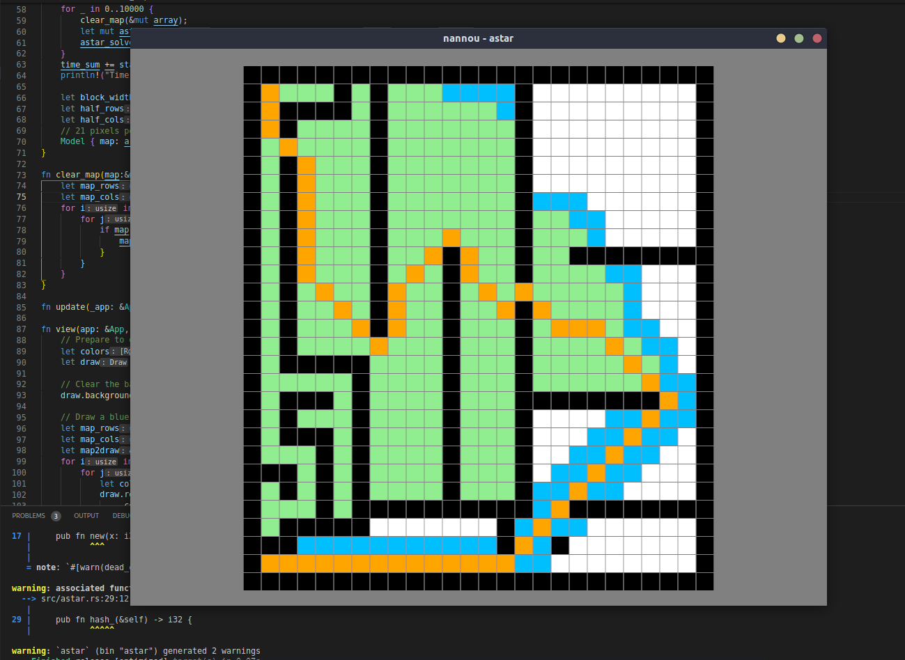

# Rusty
Repo for Rust learning, since 2022.4.29.

Learning data structure via Rust is significantly harder than doing the same thing via C++. Yet, algorithms are not as hard to implement. There is a A* example, which is as fast as its C++ counterpart (0.7s for 10000 runs, 29 * 26 map) (visualization supported by Rust nannou)

